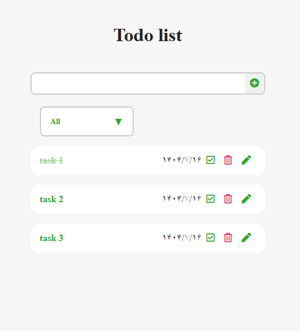

# To-Do App                                    

 
 

 #### *An app for creating a to-do list*

## list of contents
- [Introduction](#Introduction)
- [Installation](#Installation)
- [Features](#Features)
- [Technologies Used](#Technologies-Used)
- [Preview](#Preview)
- [License](#License)
- [Contact](#Contact)


## Introduction
This application allows you to create tasks, delete tasks, mark them as completed or not completed, and edit their titles. It also displays the creation date of each to-do.


## Installation
 1- Clone the repository  
  ```bash
  git clone https://github.com/ParvinBahram/search-filter-app.git
  ```

 2- Navigate to the project directory :
```bash 
cd repository-name
```


## Features
1- The app is responsive and  built with a mobile-first approach.

2- It has a category box where each task is placed according to whether it is completed or not.

3- The tasks are stored in local storage, so they are not deleted after refreshing the page or closing and reopening the browser.


## Technologies Used
 Built with **HTML** , **CSS** ,**JavaScript** 

## Preview



## License
No license restrictions — free to use for everyone.

## Contact

📧 Email: example@email.com
